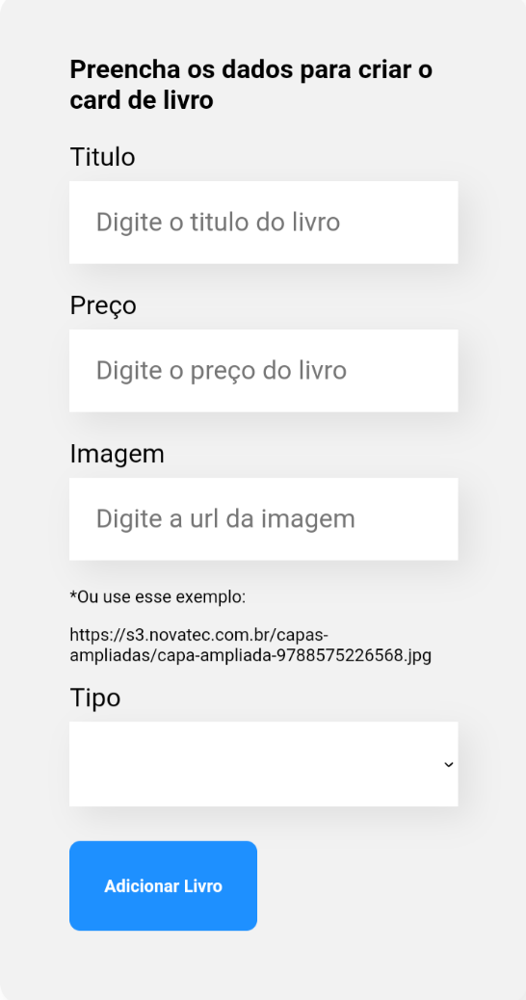

# Bookshelf
<p>
    
    
    
</p>

## Índice

* [Título](#Bookshelf)
* [Índice](#índice)
* [Descrição do Projeto](#descrição-do-projeto)
* [Funcionalidade](#funcionalidade)
* [Demonstração da Aplicação](#layout-web)
* [Pré-requisitos](#pré-requisitos)
* [Como rodar a aplicação](#como-rodar-a-apliçao)

## Descrição do projeto

<p style="text-align: justify">
    O projeto tem como finalidade o aprendizado, no qual é possível salvar temporariamente cards com informações de livros, simulando uma "Estante de Livros". 
</p>

## Funcionalidade

* Salvar e imprimir dados

## Deploy
<a target="_blank"> link: https://bookshelf-vert.vercel.app/ </a>


## Layout Web


## Layout Mobile

<div>
    
    
</div>

## Pré requisitos

<p style="text-align: justify">
    Para conseguir acompanhar a aplicação em React, é necessário que você tenha o Node instalado. Você pode baixá-lo 
<a href="https://nodejs.org/en/download/" target="_blank" >aqui</a>
</p>

## Como rodar a aplicação
Para rodar o projeto, você deve fazer o seguinte:

Clonar e abrir o projeto 
````
git clone git@github.com:Gut-0/Bookshelf.git
cd Bookshelf
code .
````
Instale as dependências
````
npm i
````
Execute o projeto
````
npm run start
````
O projeto irá rodar em [http://localhost:3000](http://localhost:3000)
